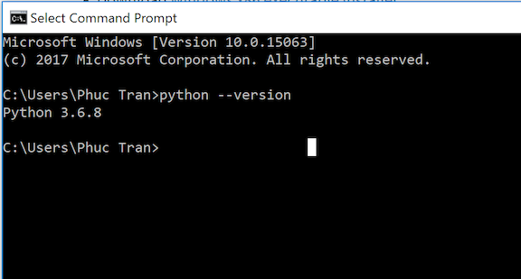
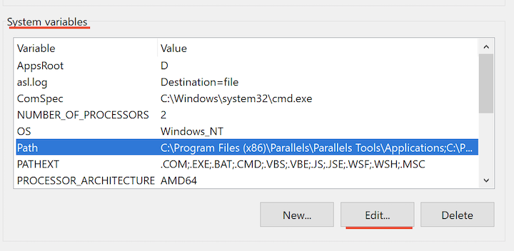
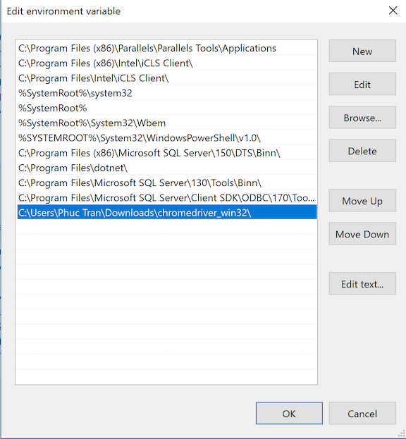
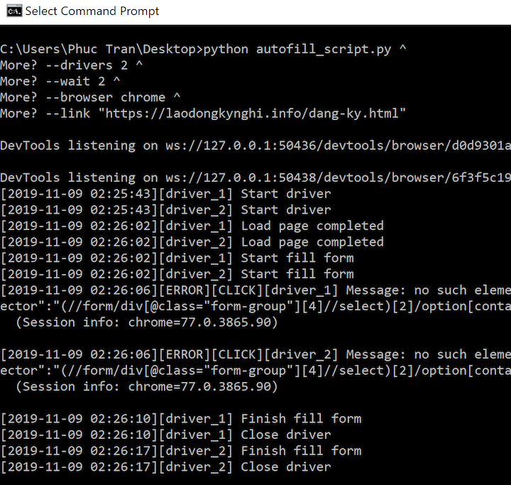

# Tự động điền form laodongkynghi Australia
Chương trình tự động điền form đăng ký ở trang: http://laodongkynghi.dolab.gov.vn

## Mục lục

* [Vài điều về chương trình này](#abouts)
* [Cài đặt môi trường](#env-setups)
  * [Phần mềm và thư viện yêu cầu](#prerequisites)
  * [Cài đặt Python cho Windows](#python-wins)
  * [Cài đặt thư viện cho Python](#python-libs)
  * [Tải và cài đặt webdriver](#webdriver)
    * [Chrome](#webdriver-chrome)
    * [Firefox](#webdriver-ff)
* [Chạy chương trình](#usage)
  * [Điền dữ liệu của vào file Data.xlsx](#fill-data)
  * [Chạy autofill_script](#run-script)
* [Notes](#notes)

<a name="abouts"></a>

## Vài điều về chương trình này
* Đây là chương trình mã nguồn mở, mọi người có thể tự do tải về và chạy theo hướng dẫn mà trong chịu bất kì khoản phí nào.
* Tác giả chương trình này không chịu trách nhiệm về bất kì trục trặc trong quá trình sử dụng chương trình này. Tuy nhiên, nếu người sử dụng muốn thông báo lỗi hoặc đóng góp cho chương trình thì vui lòng liên hệ với tác giả.
* Nếu thấy chương trình này hữu ích, các bạn có thể donate cho tác giả :smile: qua:
    * __PayPal__: https://www.paypal.me/tduyphuc
    * __VPBank__: 154817174 - Chi nhánh Hồ Chí Minh

<a name="env-setups"></a>

## Cài đặt môi trường
<a name="prerequisites"></a>

### Phần mềm và thư viện yêu cầu
* Windows 7 trở lên (ưu tiên win 10) (Đa số các bạn xài Windows nên mình viết chi tiết hướng dẫn chạy trên win, các hệ điều hành khác vẫn chạy được)
* Python 3+
* Trình duyệt: Chrome hoặc Firefox (ổn định nhất trên Chrome)
* [Chrome webdriver](https://chromedriver.chromium.org/downloads) (nếu dùng Chrome)
* [geckodriver](https://github.com/mozilla/geckodriver/releases) (nếu dùng Firefox)
* Thư viện Python: selenium, pandas, xlrd

__Lưu ý__: phiên bản driver phải đúng với phiên bản trình duyệt. Ví dụ: Chrome phiên bản 78 thì phải dùng Chrome webdriver 78.


<a name="python-wins"></a>

### Cài đặt Python cho Windows
* Vào trang: https://www.python.org/downloads/windows/ để tải Python phiên bản 3 trở lên. Link tải [Python3.6](https://www.python.org/ftp/python/3.6.8/python-3.6.8-amd64.exe).
* Sau khi tải về, chạy file __python-3.6[...].exe__, nhớ tick chọn 2 ô bên dưới !!!:

    
* Chọn __Install Now__, và đợi Python cài đặt xong:

    
* Đóng cửa sổ (nhấn __Close__), mở __Command Prompt__ (vào thanh tìm kiếm của window ở góc dưới tìm là thấy). Nhập __"python --version"__, Enter:

    
* Nếu hiện lên phiên bản Python như hình trên là thành công.

<a name="python-libs"></a>

### Cài đặt thư viện cho Python
* Mở __Command Prompt__ , cài các thư viện cần thiết bằng lệnh:
    ```
    pip3 install --upgrade selenium pandas xlrd
    ```
    
* Hiện ra như hình là thành công

<a name="webdriver"></a>

### Tải và cài đặt webdriver

<a name="webdriver-chrome"></a>

#### Chrome
* Tải Chrome webdriver ở [đây](https://chromedriver.chromium.org/downloads). Lưu ý: phải cùng phiên bản với Chrome đang có ở máy, và nhớ chọn bản cho __windows__.
* Giải nén file vừa tải về, sẽ được 1 thư mục chứa __chromedriver__.
* Nhấp chuột phải vào file __chromedriver__ > Properties.
* Sao chép đường dẫn tới file __chromedriver__ ở LocationLocation

    

* Ở thanh tìm kiếm của window, tìm "Environment variable". Sẽ thấy khung như hình dưới, chọn __"Environment Variable..."__:

    
* Ở khung "System variables", chọn dòng "Path", nhấn "Edit":
    
    
* Nhấn "New", dán đường dẫn tới webdriver đã sao chép ở trên vào dòng mới, lưu ý phải có dấu "\\" ở cuối đường dẫn:

    
* OK!

<a name="webdriver-ff"></a>

#### Firefox
* Cập nhật sau ...

<a name="usage"></a>

## Chạy chương trình
Để chạy chương trình cần có 2 file __autofill_script.py__ và __Data.xlsx__ được đặt cùng chỗ.

<a name="fill-data"></a>

### Điền dữ liệu của vào file Data.xlsx
* Điền thông tin cá nhân vào cột "Giá trị" trong file Data.xlsx, các cột khác không được thay đổi
* Phần nào không cần điền có thể bỏ trống

<a name="run-script"></a>

### Chạy autofill_script
* Sử dụng mẫu câu lệnh sau:
    ```
    python autofill_script.py ^
    --drivers <Số lượng trình duyệt mở cùng lúc> ^
    --wait <Thời gian chờ để trang web load (giây)> ^
    --browser <Loại trình duyệt, mặc định chrome>^
    --link "<Đường link đến trang có form đăng kí>"
    ```
* Ví dụ để chạy __2__ trình duyệt __chrome__ cùng lúc để điền vào trang __https://laodongkynghi.info/dang-ky.html__:
    ```
    python autofill_script.py ^
    --drivers 2 ^
    --wait 2 ^
    --browser chrome ^
    --link "https://laodongkynghi.info/dang-ky.html"
    ```
* Mở __Command Prompt__ mới, dán câu lệnh vào, Enter:

    

* Trình duyệt sẽ tự động mở lên và chạy, đừng nên tắt trình duyệt khi đang chạy.

<a name="notes"></a>

## Notes
* Khi chạy thực tế nhớ thay đường dẫn tới trang gốc thay vì trang tập luyện
* Mở từ 4-5 trình duyệt là ổn
* Khi xác nhận sẽ có yêu cầu nhập Captcha, version hiện tại chưa hỗ trợ điền Captcha tự động, bạn sẽ phải tự điền và nhấn xác nhận
* Một số trường sẽ nhập lỗi trong quá trình chạy hoặc không nhập được, vui lòng kiểm tra lại trước khi xác nhận.

